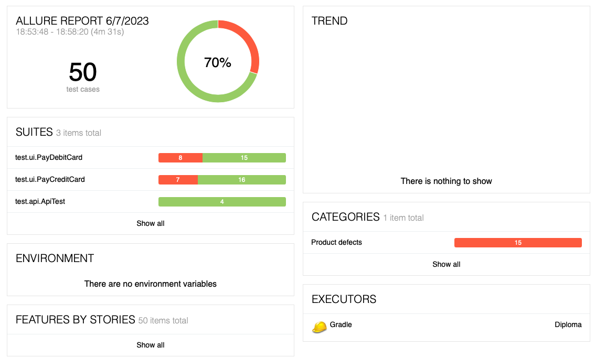
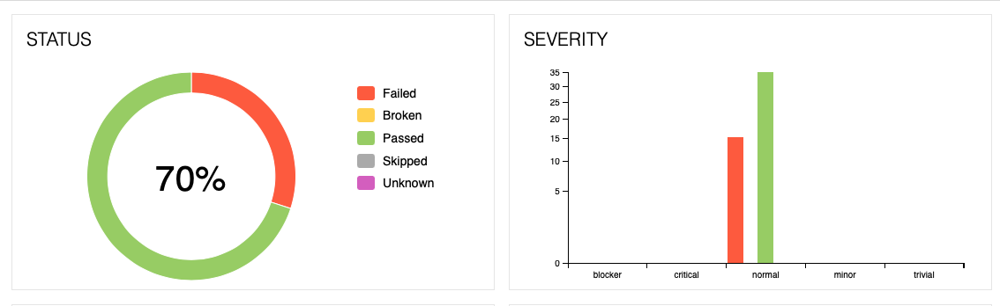
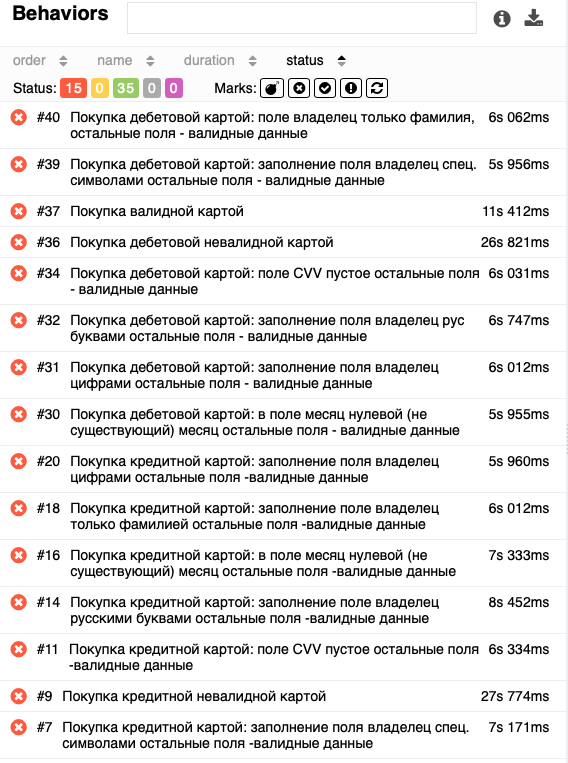

# Отчёт по итогам тестирования:

Отчёт по результату автоматизированного тестированию функционала покупки и оформления кредита по данным карты веб-сервиса покупки тура
"Путешествие дня".

## Количество Тест-кейсов:

*Результат прогона тестов не зависит от подключенной БД, поэтому предоставлен единый отчет по тестам.*

Всего было проведено 50 тест-кейсов. Общий процент успешных тестов: 70,00%.

### Разбивка итогов тестирования по серьезности и приоритету:

### Разбивка итогов тестирования по функциональности:

### Общие итоги:

|                    |Qnt | Passed | Failed | Passed, % |
|:-------------------|:--:|:------:|:------:|----------:|
| ApiTest            |  4 |   4    |   0    |      100% |
| PayDebitCardTests  | 23 |   15   |   8    |    73.91% |
| PayCreditCardTests | 23 |   16   |   7    |    69,56% |
| Total              | 50 |   35   |   15   |    70.00% |

В ходе тестирования было составлено 18 [issue](https://github.com/00Julie00/Diploma_for_portfolio/issues). 
## Общие рекомендации
- Разработать спецификацию, либо другим способом оформить требования для данного приложения;
- Исправить выявленные ошибки;
- Добавить "тестовые" атрибуты в приложение для повышения устойчивости авто-тестов.